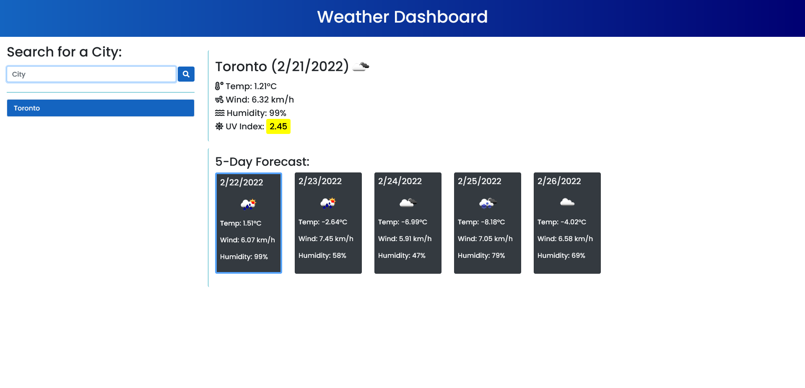

# Assignment 06: Weather Dashboard

## Description

The task was to successfully build an application that displays relevent weather data of any 
city the user enters and store the searches locally.

## APIs used:

* OpenWeather API (https://openweathermap.org/api)
* jQuery (https://jquery.com/)
* Bootstrap (https://getbootstrap.com/)
* Moment.js (https://momentjs.com/)
* Font Awesome (https://fontawesome.com/)

## Links
> Repository Link: https://github.com/nevan-dsouza/weather-dashboard/
>
> Deployed Site Link: https://nevan-dsouza.github.io/weather-dashboard/

## How the Weather Dashboard Looks 
